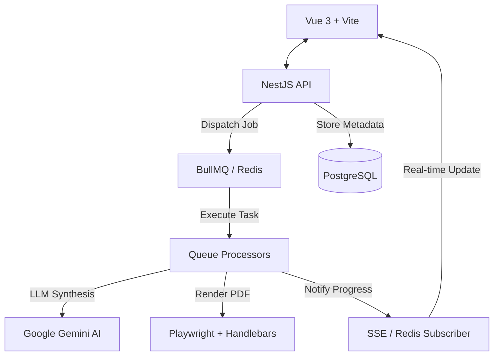
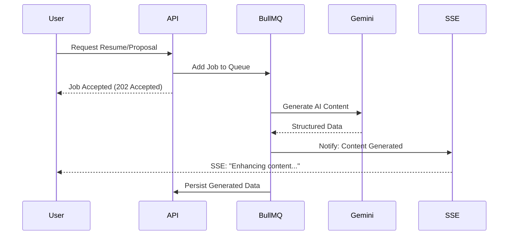
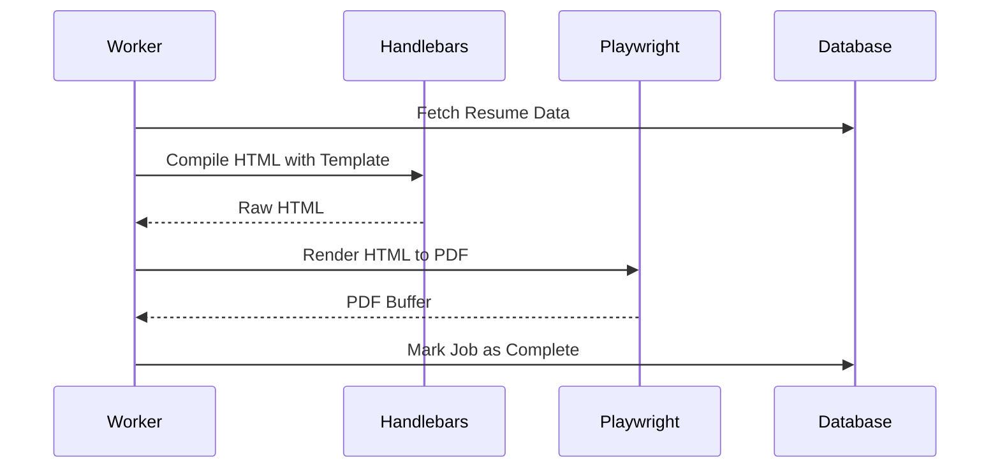

# Curriculum & Proposal Generator System (NestJS + Gemini + Vue 3)

A professional, AI-powered platform for generating tailored resumes and freelance proposals. Built with a robust NestJS backend and a reactive Vue 3 frontend, it leverages Google Gemini LLMs to synthesize content, Playwright for high-fidelity PDF generation, and BullMQ for scalable background processing.

## 🏗 Architecture Overview

The system follows a **Clean Architecture** approach with a clear separation of concerns, utilizing asynchronous processing for AI-intensive and document generation tasks.



### Core Components
-   **NestJS API**: Orchestrates authentication (Passport/JWT), user management, and AI job dispatching.
-   **Gemini Integration**: Uses `@google/generative-ai` to generate professional summaries, skill lists, and tailored proposals based on user data.
-   **BullMQ Engine**: Manages background workers for resume and proposal generation to ensure high availability.
-   **Playwright Renderer**: Converts Handlebars-templated HTML into pixel-perfect PDF documents.
-   **SSE Communication**: Provides real-time status updates to the frontend during long-running AI processes.
-   **Vue 3 Frontend**: A modern, responsive SPA built with Tailwind CSS, Pinia, and Vee-Validate.

## 📂 Project Structure Mapping

The repository is divided into a dedicated backend and frontend:

### Backend (`/backend`)
```text
src/
├── application/
│   ├── use-cases/      # Business logic (Resume, Freelance, User)
│   └── queues/         # BullMQ queue definitions
├── domain/
│   ├── entities/       # Core domain models (Resume, User, Proposal)
│   ├── repositories/   # Abstract repository interfaces
│   └── enums/          # Domain-specific constants
├── infrastructure/
│   ├── queue/          # BullMQ processors (Resume/Freelance workers)
│   ├── services/       # External integrations (Gemini, Playwright, Discord)
│   ├── database/       # TypeORM entities and migrations
│   └── sse/            # Real-time event broadcasting logic
├── presentation/
│   ├── controllers/    # REST API endpoints
│   └── dto/            # Data Transfer Objects
└── templates/
    ├── page/           # Handlebars templates for web view
    └── pdf/            # Handlebars templates for PDF generation
```

### Frontend (`/frontend`)
```text
src/
├── components/         # Shared UI and domain components
├── composables/        # Vue Composition API logic (API, SSE, Theme)
├── services/           # API and SSE client integrations
├── stores/             # Pinia state management (Auth)
├── views/              # Page components (Resume, Freelance, Reports)
└── interfaces/         # TypeScript type definitions
```

## 🔄 System Flows

### 1. AI-Powered Generation Flow
Users provide basic data, and the system uses Gemini to enhance and tailor the content for specific roles or proposals.



### 2. PDF Document Generation
The system uses Playwright to render HTML templates populated with generated data into professional PDF files.



## 🚀 Key Features

1.  **Intelligent Content Synthesis**:
    -   **Contextual Proposals**: Generates tailored freelance proposals based on project descriptions.
    -   **Resume Enhancement**: Automatically expands bullet points and summaries using professional terminology.
2.  **Robust Document Engine**:
    -   **Playwright Integration**: High-fidelity PDF exports that match the web preview exactly.
    -   **Handlebars Templating**: Easy-to-extend template system for both web and PDF formats.
3.  **Real-time UX**:
    -   **SSE Progress Updates**: Users see exactly what the AI is doing (e.g., "Analyzing experience", "Synthesizing skills").
    -   **Responsive Design**: Optimized for both mobile and desktop usage.
4.  **Security & Scalability**:
    -   **Multi-provider Auth**: Support for Google, GitHub, and standard JWT.
    -   **Background Processing**: BullMQ ensures that slow AI calls never block the main API thread.

## 🛠 Usage & Extension

### Environment Setup
1.  **Backend**:
    ```env
    DATABASE_URL=postgres://...
    GEMINI_API_KEY=your_key
    REDIS_HOST=localhost
    GOOGLE_CLIENT_ID=...
    GITHUB_CLIENT_ID=...
    ```
2.  **Frontend**:
    ```env
    VITE_API_URL=http://localhost:3000
    ```

### Adding New Templates
1.  **Create Template**: Add a new `.hbs` file in `backend/src/templates/pdf/`.
2.  **Update Enums**: Add the template identifier to `backend/src/domain/enums/resume.enums.ts`.
3.  **Frontend Support**: Add the template preview in the frontend generator view.
